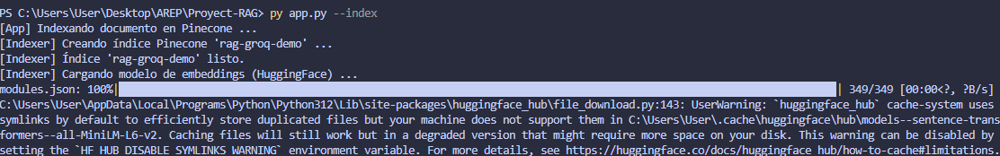
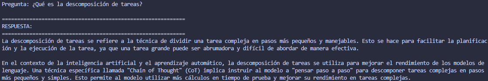
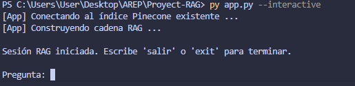

# RAG con LangChain + Groq + Pinecone

> **Laboratorio AREP – Repositorio 2**  
> Implementación de un sistema de Generación con Recuperación Aumentada (RAG) usando LangChain, Groq como LLM, embeddings locales de HuggingFace y Pinecone como base de datos vectorial.

---

## Tabla de contenidos

1. [Descripción general](#descripción-general)
2. [Arquitectura del proyecto](#arquitectura-del-proyecto)
3. [Componentes principales](#componentes-principales)
4. [Requisitos previos](#requisitos-previos)
5. [Instalación](#instalación)
6. [Configuración de API Keys](#configuración-de-api-keys)
7. [Ejecución](#ejecución)
8. [Uso del notebook](#uso-del-notebook)
9. [Estructura de archivos](#estructura-de-archivos)
10. [Flujo del pipeline RAG](#flujo-del-pipeline-rag)
11. [Referencias](#referencias)

---

## Descripción general

Este proyecto implementa un sistema **RAG (Retrieval-Augmented Generation)** que permite hacerle preguntas a un modelo de lenguaje (**Llama 3.3** vía Groq) sobre el contenido de un documento específico, evitando respuestas inventadas (“alucinaciones”).

El documento base es el blog post de Lilian Weng:  
**["LLM Powered Autonomous Agents"](https://lilianweng.github.io/posts/2023-06-23-agent/)** (2023).

El sistema divide ese artículo en fragmentos, los convierte a vectores y los almacena en **Pinecone**. Cuando el usuario hace una pregunta, recupera los fragmentos más relevantes y los usa como contexto para generar una respuesta precisa.

---

## Arquitectura del proyecto

```
┌─────────────────────────────────────────────────────┐
│                    FASE DE INDEXACIÓN                │
│                                                     │
│  Web URL ──▶ WebBaseLoader ──▶ RecursiveTextSplitter│
│                                      │              │
│                              chunks (1 000 chars)   │
│                                      │              │
│                  HuggingFaceEmbeddings (384 dim)     │
│                         (local, sin API key)         │
│                                      │              │
│                              PineconeVectorStore    │
└─────────────────────────────────────────────────────┘

┌─────────────────────────────────────────────────────┐
│               FASE DE RECUPERACIÓN & GENERACIÓN     │
│                                                     │
│  Query ──▶ Embeddings ──▶ Pinecone Similarity Search│
│                                  │                  │
│                            top-k chunks             │
│                                  │                  │
│                          ChatPromptTemplate         │
│                         (sistema + contexto + query)│
│                                  │                  │
│                       ChatGroq (llama-3.3-70b)       │
│                                  │                  │
│                        Respuesta + Fuentes citadas  │
└─────────────────────────────────────────────────────┘
```

---

## Componentes principales

| Componente        | Tecnología                          | Detalle                           |
| ----------------- | ----------------------------------- | --------------------------------- |
| **LLM**           | Groq `llama-3.3-70b-versatile`      | Generación de respuestas (gratis) |
| **Embeddings**    | HuggingFace `all-MiniLM-L6-v2`      | 384 dims, corre local             |
| **Vector Store**  | Pinecone Serverless (AWS us-east-1) | Métrica coseno                    |
| **Orquestación**  | LangChain LCEL                      | Cadena declarativa con `\|`       |
| **Carga de docs** | `WebBaseLoader` + BeautifulSoup     | Blog post HTML                    |
| **División**      | `RecursiveCharacterTextSplitter`    | 1 000 chars / 200 overlap         |

---

## Requisitos previos

- Python **3.10+**
- Cuenta y API Key de **[Groq](https://console.groq.com/keys)** (gratuito, solo registro)
- Cuenta y API Key de **[Pinecone](https://app.pinecone.io/)** (plan gratuito suficiente)
- Git

---

## Instalación

### 1. Clonar el repositorio

```bash
git clone https://github.com/<tu-usuario>/Proyect-RAG.git
cd Proyect-RAG
```

### 2. Crear entorno virtual

```bash
python -m venv .venv

# Windows
.venv\Scripts\activate

# Linux / macOS
source .venv/bin/activate
```

### 3. Instalar dependencias

```bash
pip install -r requirements.txt
```

---

## Configuración de API Keys

Copia el archivo de ejemplo y completa tus claves reales:

```bash
cp .env.example .env
```

Edita `.env`:

```env
GROQ_API_KEY=gsk_...
GROQ_LLM_MODEL=llama-3.3-70b-versatile
PINECONE_API_KEY=...
PINECONE_INDEX_NAME=rag-groq-demo
USER_AGENT=RAG-LangChain-Demo/1.0
```

> ⚠️ **Nunca subas `.env` a GitHub.** Ya está incluido en `.gitignore`.

---

## Ejecución

### Indexar documentos en Pinecone (primera vez)

```bash
python app.py --index
```

Salida esperada:

```
[App] Indexing document into Pinecone ...
[Indexer] Loading document from: https://lilianweng.github.io/posts/2023-06-23-agent/
[Indexer] Loaded 1 document(s). Total characters: 43,131
[Indexer] Split into 66 chunks.
[Indexer] Upserting documents into Pinecone ...
[Indexer] Indexing complete.
```



### Hacer una pregunta directa

```bash
python app.py --ask "¿Qué es la descomposición de tareas?"
```

Salida esperada:

```
============================================================
ANSWER:
============================================================
Task decomposition is the process of breaking down a complex task into smaller,
more manageable subtasks. Common approaches include:
- Chain of Thought (CoT): prompting the model to "think step by step".
- Tree of Thoughts (ToT): exploring multiple reasoning paths simultaneously.
- LLM+P: using an external planner with PDDL problem descriptions.

------------------------------------------------------------
SOURCES (4 chunk(s) retrieved):
------------------------------------------------------------
  [1] https://lilianweng.github.io/posts/2023-06-23-agent/  (offset 2145)
       "Task decomposition can be done (1) by LLM with simple prompting like..."
```



### Modo interactivo

```bash
python app.py --interactive
```



### Indexar Y preguntar en un solo comando

---

## Uso del notebook

El notebook `notebooks/rag_demo.ipynb` ilustra cada paso del pipeline con outputs de ejemplo.

```bash
pip install notebook
jupyter notebook notebooks/rag_demo.ipynb
```

O ábrelo directamente desde VS Code con la extensión **Jupyter**.

**Secciones del notebook:**

1. Instalación de dependencias
2. Configuración de claves (solo Groq + Pinecone)
3. Carga de documentos (`WebBaseLoader`)
4. División en chunks (`RecursiveCharacterTextSplitter`)
5. Generación de embeddings locales (`HuggingFaceEmbeddings`)
6. Almacenamiento en Pinecone (`PineconeVectorStore`)
7. Creación del Retriever
8. Construcción de la cadena RAG con LCEL + Groq
9. Consultas con respuestas y fuentes citadas

---

## Estructura de archivos

```
Proyect-RAG/
│
├── app.py                  # Punto de entrada CLI
│
├── src/
│   ├── __init__.py
│   ├── indexer.py          # Carga, divide y almacena documentos en Pinecone
│   └── rag.py              # Cadena RAG con LCEL (retriever + prompt + LLM)
│
├── notebooks/
│   └── rag_demo.ipynb      # Tutorial interactivo paso a paso
│
├── requirements.txt        # Dependencias del proyecto
├── .env.example            # Plantilla de variables de entorno
├── .gitignore
└── README.md
```

---

## Flujo del pipeline RAG

```
Documentos web
      │
      ▼
 WebBaseLoader          ← Descarga y parsea el HTML del blog post
      │
      ▼
RecursiveCharacterTextSplitter  ← chunks de 1 000 chars / 200 overlap
      │
      ▼
HuggingFaceEmbeddings  ← Vectores de 384 dims (local, sin costo)
      │
      ▼
PineconeVectorStore     ← Índice vectorial con similitud coseno
      │
      │◄──── Query del usuario
      ▼
Retriever.invoke()      ← Top-4 chunks más similares
      │
      ▼
ChatPromptTemplate      ← Sistema + contexto + pregunta
      │
      ▼
ChatGroq (llama-3.3-70b)← Respuesta contextualizada
      │
      ▼
{"answer": ..., "sources": [...]}
```

---

## Referencias

- [LangChain RAG Tutorial](https://python.langchain.com/docs/tutorials/rag/)
- [LangChain Pinecone Integration](https://python.langchain.com/docs/integrations/vectorstores/pinecone)
- [Pinecone Documentation](https://docs.pinecone.io/)
- [Groq API – Modelos disponibles](https://console.groq.com/docs/models)
- [HuggingFace – all-MiniLM-L6-v2](https://huggingface.co/sentence-transformers/all-MiniLM-L6-v2)
- [LLM Powered Autonomous Agents – Lilian Weng](https://lilianweng.github.io/posts/2023-06-23-agent/)
